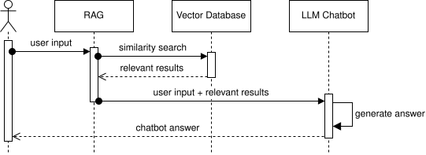

# RAG Agent for Document Knowledge Search through the Example of Beckhoff Company Data

The idea is that an agent can be used to answer questions about products, company details and other informations about
the Beckhoff company.
The data is retrieved from the Beckhoff website (here we focus on only the company details website) and stored in a
vector database.
The agent can then use this data to answer questions about the company.

This agent can help employees to quickly find information about the company without having to search through the website
or ask colleagues.
This would be especially useful for product details, where the information is often very detailed.

## Installation & Usage

Create a virtual environment, activate it and install the required dependencies with the following commands:

```bash
python -m venv programming_task
```

```bash
source programming_task/bin/activate
``` 

```bash
pip install -r requirements.txt
```

### Using Agent with a Cloud LLM

To run the agent with a cloud LLM create a [ollama](ollama.com) account and create an API key.
Then, add the API key as a string to the [.env](.env) file in the root of the project with the variable name
`OLLAMA_API_KEY`.

Afterwards you can start the agent with the following command:

```bash
python main.py
```

### Using Agent with a Local LLM

You can also use a local LLM. For this download a model that can be run locally on your PC (e.g. gemma3) from ollama:

```bash
ollama pull gemma3
```

Adjust the variable `LOCAL_MODEL_LLM` in the [config.py](src/config.py) file to the name of the model you downloaded (
e.g. `gemma3`).
Then, you can start the agent with the following command:

```bash
python main.py --local
```

### Testing

Run the unit tests with the following command:

```bash
pytest tests
```

## Architecture

The architecture of the program consists of the following components:

- user: the user interacts with the agent through a console input
- [RAG module](src/rag.py): this module is responsible for retrieving the relevant documents from the vector database
  based on the user's query
    - library: langchain for text splitting, embeddings model and database (local + cloud, different components for
      different steps of the RAG process are replaceable)
    - html parser: this component is responsible for parsing the html documents and extracting the relevant information
      to be stored in the vector database
        - libraries: BeautifulSoup (optimized for parsing html documents)
    - embeddings model: this component is responsible for converting the text data into vector arrays that can be stored
      in the vector database and used for retrieval
        - library: HuggingFaceEmbeddings (can be used to download different embedding models from HuggingFace, can be
          easily integrated with langchain)
        - model: microsoft/harrier-oss-v1-0.6b (comparison of different models on
          the [Embedding Leaderboard auf Huggingface](https://huggingface.co/spaces/mteb/leaderboard) for multilingual
          retrieval (for German), sort by performance on retrieval tasks, chosen because it is smaller than 1b
          parameters, can be run locally on CPU)
    - vector database: this is where the documents are stored as vectors
        - library: chromadb (integrateable with langchain, local + cloud, open source)
- [LLM chatbot](src/llm_chatbot.py): this is the language model that generates the response based on the retrieved
  documents and the user's query
    - library: Ollama (local + cloud LLM hosting possible, easy usage in Python, no API key needed, open source models
      available)
    - model:
        - local LLM:
            - first idea: Qwen3-8B (comparison of different models on the HuggingFace leaderboard for text generation ->
              most
              downloaded, smaller model that still can be run locally on CPU) -> way to slow
            - final choice: gemma3:4b ("most capable model that runs on a single GPU")
        - cloud LLM: only free cloud LLMs are possible (sort most downloaded models from ollama cloud models)
            - first idea: qwen3.5-cloud (not available for free cloud usage) -> not possible
            - final choice: gemma4:31b-cloud

The workflow is shown in the following sequence diagram:



The user inputs a query, which is then processed by the RAG module to retrieve relevant documents from the vector
database.
The retrieved documents and the user input are then passed to the LLM chatbot, which generates a response based on the
documents and the user's query.

### Code Quality

- use different modules for different components of the architecture (e.g. separate module for RAG, LLM chatbot, etc.)
  to improve code organization and readability
- implement unit tests in the [`tests`](tests) directory
- use typ annotations and comments to improve code readability
- use automatic code formatting tools to maintain a consistent code style

### Example Test Case: Retrival Test

In addition to unit tests, one should also test the retrieval of the RAG module with an example test case.
This can be done by creating a test dataset with questions and answers about the Beckhoff company and evaluating if the
RAG module retrieves the relevant documents that are expected.
The following steps can be taken to implement this test case:

1. Create a test dataset with questions and the expected document that should be retrieved by the RAG module
2. Check if the relevant document was retrieved by the RAG module for each question in the test dataset
3. Calculate the accuracy to evaluate the performance of the RAG module

## Limitations and Future Work

### Architecture

1. local LLM/ free cloud LLM: only local/free cloud LLM models usable due to costs of using bigger cloud LLMs
   excessively, which limits the performance.
   <br> -> use bigger cloud LLMs or LLMs run on a GPU for better performance
2. containerization: currently the different components of the architecture are not containerized, which can lead to
   issues with dependencies and scalability.
   <br> -> containerize the different components of the architecture (e.g. with Docker)

### Evaluation & Testing

1. evaluation: currently there is no evaluation of the agent's performance, which makes it difficult to identify areas
   for improvement and compare different versions of the agent.
   <br> -> implement an evaluation process for the agent (e.g. create an evaluation dataset with questions & answers
   about the Beckhoff company, use metrics such as accuracy to evaluate the performance of the agent)
2. no monitoring: currently there is no monitoring of the agent's performance or usage (e.g. answer quality,
   halluzination rate, latency, token usage), which makes it difficult to identify issues and improve the agent over
   time.
   <br> -> implement a monitoring solution to track the agent's performance and usage (e.g. logging, analytics, github
   pipelines)
3. user feedback: currently there is no mechanism for users to provide feedback on the agent's responses, which makes it
   difficult to improve the agent based on user needs.
   <br> -> implement a user feedback mechanism to allow users to provide feedback on the agent's responses (e.g. thumbs
   up/down, comment section, etc.)

### Use-Case Extensions

1. web scraping: currently not possible due to 403 error when trying to scrape the Beckhoff website.
   <br> -> use alternative methods to retrieve the data (e.g. using an API if available, manually downloading the data)
2. limited data: currently only the company details page of the Beckhoff website is used, which limits the amount of
   information available to the agent.
   <br> -> include more data from the Beckhoff website (e.g. product details, news, etc.) to provide more information to
   the agent
3. console input: currently the user interacts with the agent through a console input, which is not very user-friendly
   and limits the accessibility of the agent.
   <br> -> implement a more user-friendly interface (e.g. web interface, mobile app, etc.) for the user to interact with
   the agent
4. data type for RAG retrieval: currently only text data from html sites is used, which limits the type of information
   that can be retrieved and used by the agent.
   <br> -> include other types of data (e.g. images, videos, etc.) and file formats to provide more information to the
   agent
5. RAG improvement: currently chunk size and other parameters of the RAG module are not optimized, which can lead to
   suboptimal retrieval performance.
   <br> -> optimize the parameters of the RAG module (e.g. chunk size, number of retrieved documents, etc.)

### Scaling

1. instances of the agent: currently only one instance of the agent can be run, which limits the scalability of the
   solution.
   <br> -> implement a solution to run multiple instances of the agent & their RAG module (e.g. using containerization
   or cloud services)
2. missing caching mechanism: currently there is no caching mechanism in place, which can lead to performance issues
   when the same queries are made multiple times.
   <br> -> implement a caching mechanism to store the results of previous queries & retrival results

### Safety

1. harmful content: currently there are no safety measures in place to prevent the agent from generating harmful or
   inappropriate content (e.g. through prompt injection), which can lead to issues with user trust and potential harm.
   <br> -> implement safety measures (e.g content filtering or user feedback mechanisms)
2. data privacy: currently there are no measures in place to protect the privacy of the user's data, which can lead to
   issues with user trust
   <br> -> implement data privacy measures (e.g. data encryption, anonymization, etc.) to protect the user's data
3. access control: currently there are no measures in place to control who can access the agent and its data, which can
   lead to issues with unauthorized access and potential misuse (e.g. by bots)
   <br> -> implement access control measures (e.g. authentication, authorization, etc.) to control who can access the
   agent and its data